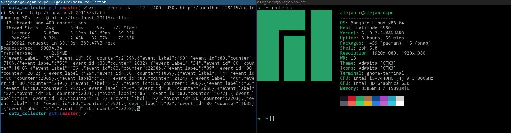

Нужно написать бэкенд на python3(asyncio) или golang.

* Назначение бэкенда - сбор статистики по событиям, происходящим на странице пользователя. Любое событие имеет 2 аттрибута: id страницы и метка действия, например его можно представить так: {"id": 123, "label": "view"}.
* Бэкенд должен инкрементить счётчики для пары (id; label) в базе.
* Требование к базе - mysql. Структура таблиц - нужно придумать.
* Требование к бэкенду - он должен выдерживать высокие нагрузки и при этом стараться минимально нагружать базу.
  Пусть, 10000rps - это средняя нагрузка, 50000rps - пиковая.
  Кроме того выбор технологий для реализации должен быть таким чтоб постараться минимально грузить канал и более того стараться минимизировать кол-во новых запросов (socket connect).
  Тут речь о выборе протокола для транспорта данных. Выбирать обязательно с оглядкой на https://caniuse.com, т.к. события всё же шлются из браузера.
* Требование к упаковке решения - нужно написать Dockerfile + docker-compose.yml, чтобы решение можно было легко поднять командой docker-compose up.
  Базы/кэши/само приложение и пр. - всё нужно реализовать отдельными сервисами в compose файле.

## Testing 
```shell
# containers up
bash dev.sh
```

test 
```shell
wrk -s bench.lua -t12 -c400 -d30s http://localhost:29115/collect && curl http://localhost:29115/state
hey -m POST -d '{"id":123,"label":"view"}' -z 10s http://localhost:29115/collect && curl http://localhost:29115/state
```


concat via copy
```go
buf := make([]byte, len(e.label)+1+int(unsafe.Sizeof(e.id)))
count := 0
count += copy(buf[count:], strconv.Itoa(int(e.id)))
count += copy(buf[count:], "_")
count += copy(buf[count:], e.label)
lbl := string(buf)
```